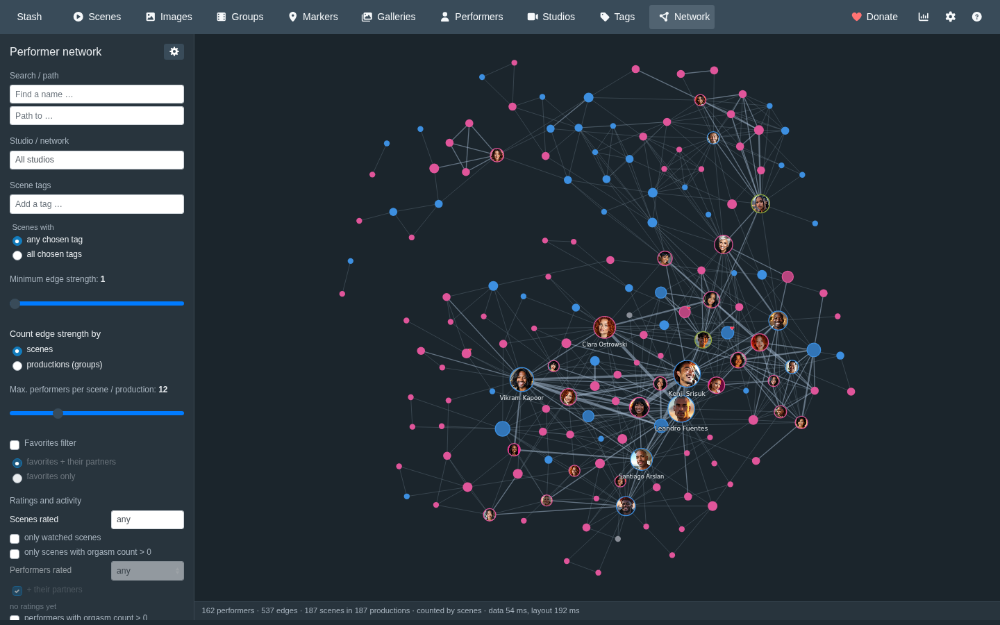
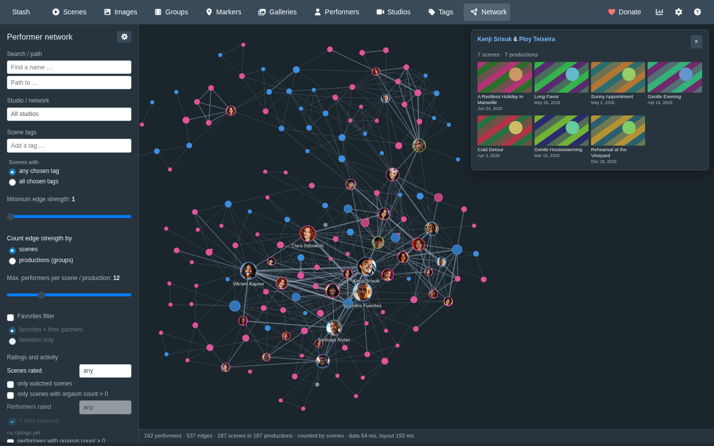
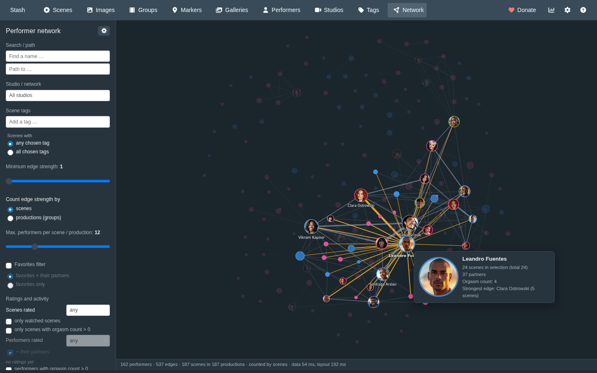
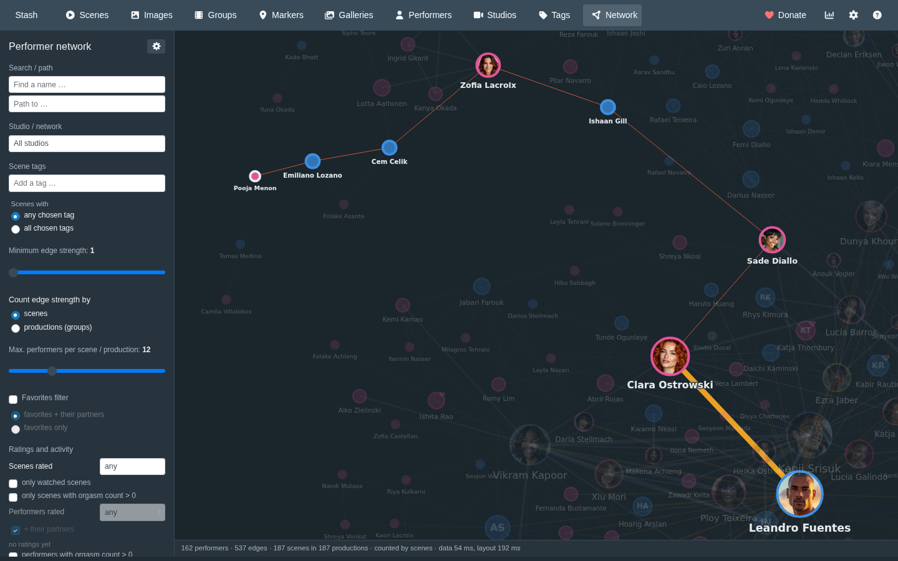
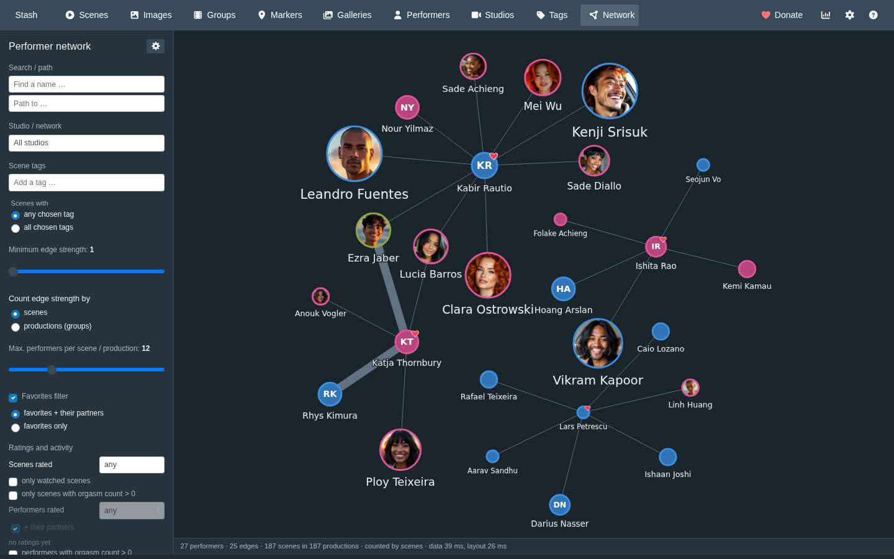
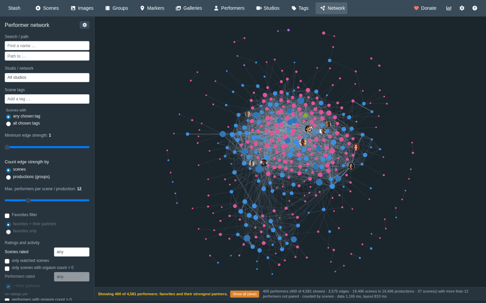
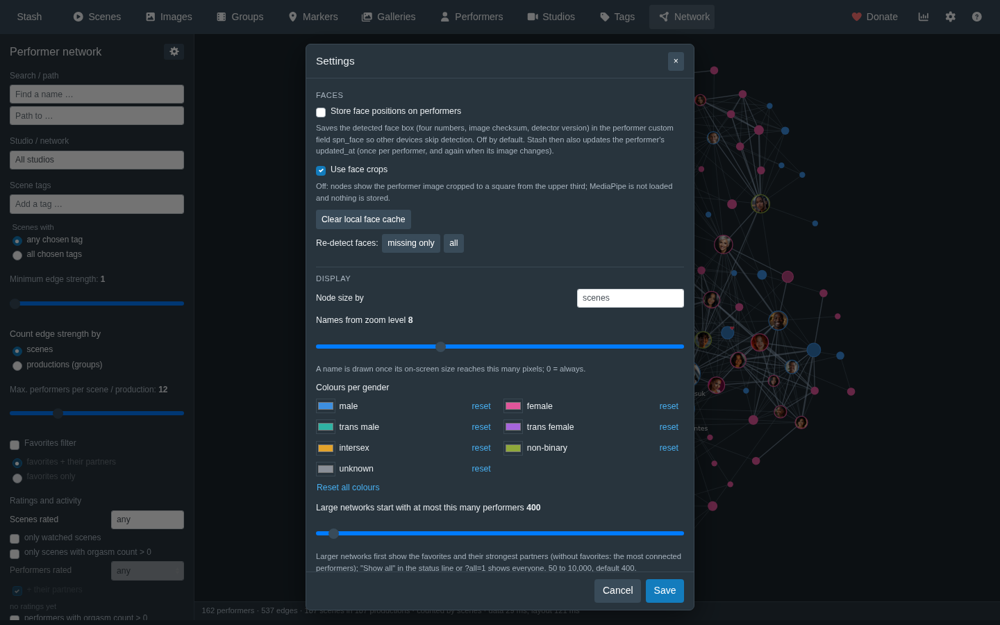

# Performer Network for Stash

[](https://github.com/stashapp/stash)
[](CHANGELOG.md)
[](LICENSE)

A [Stash](https://github.com/stashapp/stash) UI plugin that draws a network of who performed with whom:
each performer is a node, each collaboration an edge, and the more often two performers worked together,
the thicker the edge.



The screenshots show an invented library: made-up names and studios, AI-generated faces and striped
placeholder covers. No real people and no real data.

## Installation

### From the plugin source (recommended)

In Stash: Settings → Plugins → Available Plugins → Add Source, with the URL

```
https://max-dev42.github.io/stash-plugins/index.yml
```

then install **Performer Network** from that source. Stash shows updates there.

### By hand

Copy the `plugin/` folder into Stash's plugins directory under the name `stash-performer-network` (the
folder name and `stash-performer-network.yml` must match), then reload plugins (Settings → Plugins →
Reload plugins).

```
<stash config>/plugins/stash-performer-network/
  stash-performer-network.yml
  stash-performer-network-core.js
  stash-performer-network.js
  stash-performer-network.css
  locales/
  vendor/
```

The page is at `/performer-network`; the navbar gets a "Network" entry.

## Features

- Live data from Stash's GraphQL API; no server component, no request leaves the Stash origin.
- Force-directed layout: node size by scene count (or orgasm count), edge width by shared scenes or
  productions, border colour by gender, a heart for favorites, a badge for rated performers.
- Hover a performer for a card, click to highlight their network, double-click to open their page.
- Shortest path between two performers (Ctrl/Cmd-click or search), with the shared scenes of every step.
- Click an edge to see the shared scenes and image sets as tiles that link to Stash.
- Filters: studio or network, scene tags (any/all), edge strength, performers per scene, favorites,
  gender, ratings, watched scenes and orgasm count.
- Optional face crops, detected locally in the browser; the usage statistics the bundled MediaPipe library
  would send to Google are blocked ([details](docs/faces.md#no-requests-to-other-hosts)).
- Settings dialog backed by Stash's plugin settings, so they are the same on every device.
- Follows the Stash theme (dark or light) and the Stash interface language: English, German, French,
  Spanish, Italian.

| Shared scenes of an edge | Highlight and hover card | Shortest path |
|---|---|---|
|  |  |  |
| **Favorites and their partners** | **Large library: reduced start** | **Settings** |
|  |  |  |

## Documentation

- [Features in detail](docs/features.md): counting rule, filters, tag field, ratings and activity
- [Settings and URL parameters](docs/settings.md)
- [Face crops and privacy](docs/faces.md): what runs in the browser and what is stored
- [Translating](docs/translating.md): languages and how to add one
- [Bundled third-party code](docs/third-party.md): libraries, licenses, checksums, updates
- [Contributing](CONTRIBUTING.md): demo, tests, code layout
- [Changelog](CHANGELOG.md)

## License

MIT, see [LICENSE](LICENSE). Bundled libraries keep their own licenses, see
[docs/third-party.md](docs/third-party.md).
