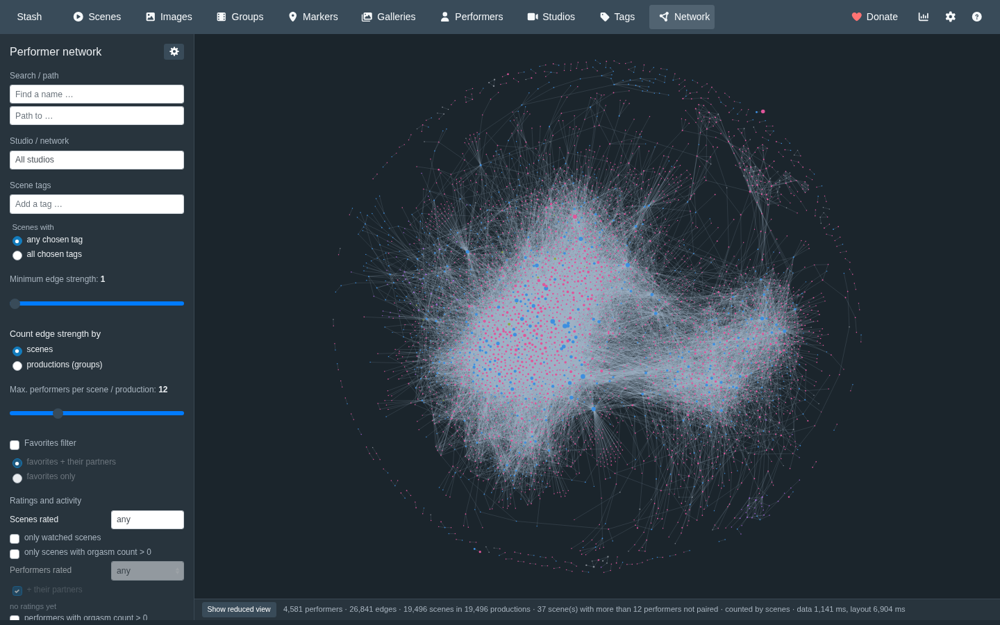
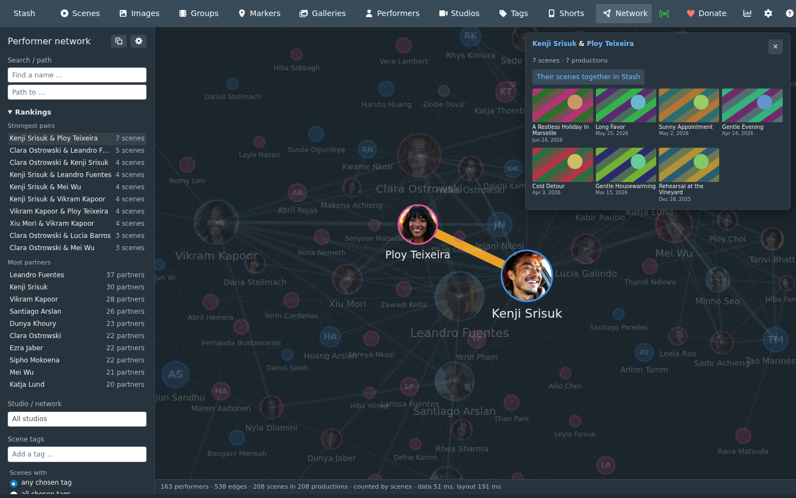
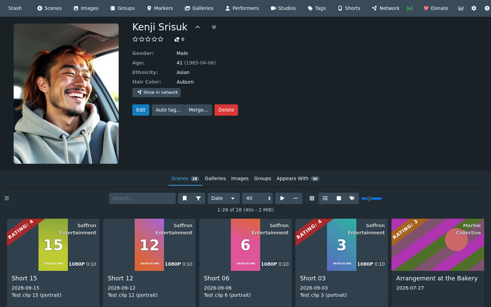
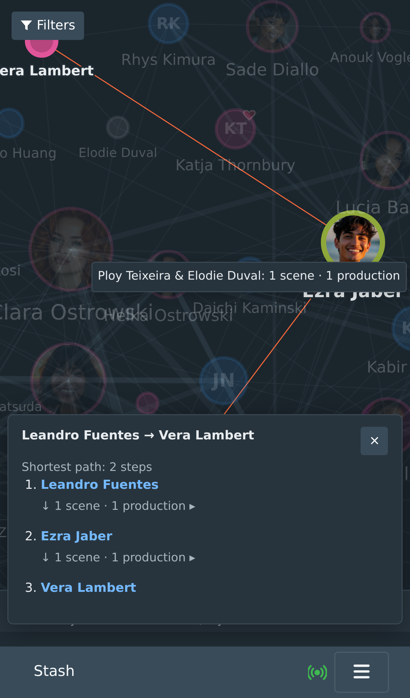

# Features

The plugin adds a page at `/performer-network` and a navbar entry ("Network"). The route is not under
`/plugin/…`, because Stash serves `/plugin/*` itself and a page reload there would return 404.

## The network

- Data comes live from Stash's GraphQL API (same origin, no API key needed in the browser). The page
  first loads only what the network needs (ids, date and numbers per scene, each performer once). The
  scenes come in pages of 2,000, a few at a time, and the status line counts them ("Loading scenes:
  8,000 of 19,496"). Each performer's scene count is taken from those scenes. The performers' orgasm
  counts follow in the background; node size by orgasm count and the performer orgasm filter wait for
  them. The tags of the scenes follow in the background too (the tag field says "Loading scene tags"
  until then, and a tag filter set by URL or defaults waits for them), and titles, screenshots and
  galleries of scenes are fetched when an edge or a path step is opened. Filtering happens in the
  browser, so changing a filter needs no new request. With 19,496 scenes and 5,395 performers the data
  takes about 1.0 s (1.3 to 1.5 s with the single query of 0.1.x).
- Force-directed layout (vis-network's forceAtlas2Based model). Networks from 150 performers on are laid
  out in a background thread (Web Worker), so the page stays responsive; smaller ones by vis-network
  itself, in short steps. Node size ~ square root of the scene count in the current
  selection (or of the orgasm count, see [Ratings and activity](#ratings-and-activity)), edge width ~
  number of collaborations, border colour = gender, a small heart marks favorites, a small badge with a
  star shows the performer rating. Names appear when zoomed in (setting "Minimum name size on screen").
- Level of detail by zoom: nodes small on screen are plain dots in the gender colour (hearts and
  badges from 5 pixels radius on); larger ones show coloured initials and then a crop of the performer
  image, see [faces.md](faces.md).
- Follows the Stash theme: dark by default, light colours when custom CSS makes the page light.

## Interaction

The sidebar with search and filters can be closed (× next to the gear); a "Filters" button over the
network opens it again. On narrow screens (phones) it starts closed and opens over the network, the
network fills the screen and the detail panel sits at the bottom. The choice is remembered per screen
class in this browser.

- **Hover** a performer: their partners are highlighted and a card shows a larger face, the scene
  count, the number of partners and the strongest edge.
- **Click** a performer: their network stays highlighted (the performer, direct partners and the edges
  among them; everything else greyed out) and the detail panel lists the partners with a button to open
  the performer page. Click again, press Esc or click the background to reset. **Double-click** opens
  the performer page directly.
- In the person detail, every partner has a gender sign (♀ ♂ ⚧ ⚥ ⚲ ?, coloured like the node border,
  with a text label for screen readers); hovering or focusing a partner shows a mini card with their
  face, scenes in total, number of partners and what they share with the selected performer.
- **Shortest path**: Ctrl-click (Mac: Cmd-click) two performers, or type a name into the search field
  and another into "Path to …". The path is the one with the fewest steps; among equally short paths
  the one with the larger sum of edge strengths wins. The detail panel lists every station with the
  shared scenes (collapsed; expand a station to see its tiles). If there is no path with the current
  filters, a hint says so.
- **Touch screens**: "Path from here" in the person detail starts a path; tapping a second performer
  (or "Path from … to here" in their detail) shows it.
- **Click an edge** to see when the two worked together (first and last date of their shared scenes;
  also on the partner card in the person detail) and the shared scenes as small tiles (screenshot, title, date, newest first); the
  group of a scene is a small link under its tile. Below, one collapsed section "Image sets (n)" holds
  all galleries linked to those scenes (cover, image count, no duplicates); its images load only when it
  is opened. Every tile links to the Stash page (middle-click or Ctrl/Cmd-click opens a new tab), all
  images load lazily, and opened sections stay open for the browser session.
- **To Stash's scene list**: the edge detail has "Their scenes together in Stash" (filter: performers
  includes all of the two), the person detail "Scenes in Stash". Stash applies its own filter only, so
  with studio, tag or cast filters set here, Stash can list more scenes than the edge.
- **Rankings** (sidebar, collapsible): the ten strongest pairs and the ten performers with the most
  partners in the shown network. A pair opens like a clicked edge (with a zoom to both), a performer
  like a clicked node.
- **From the performer page**: "Show in network" (last item of the details) opens the network with
  that performer highlighted (`?focus=<id>`).
- **Copy link to this view** (button next to the gear): the current filters, the counting and the
  highlighted performer, edge or path as a link ([URL parameters](settings.md#url-parameters)).

| Shared scenes of an edge | Highlight and hover card | Shortest path |
|---|---|---|
|  |  |  |
| **Favorites and their partners** | **Large library: reduced start** | **Show all (4,581 performers)** |
|  |  |  |
| **Rankings, edge with link to Stash** | **"Show in network" on the performer page** | **Phone: path by tapping** |
|  |  |  |

## Counting rule

Edge strength is counted in one of two ways (sidebar "Count edge strength by"; kept in the URL as
`?count=scenes|productions` and for the browser session; default: scenes). The status line names the
active mode; the path search, highlighting and the hover card's "strongest edge" use it.

- **Scenes** (default): every shared scene counts 1. Scenes with more than N performers (slider,
  default 12) are not turned into pairs.
- **Productions (groups)**: all scenes of the same group count as **one** collaboration (a shoot
  released as several scenes counts once); scenes without a group count individually. A scene in
  several groups counts for the group with the lowest id. Productions with more than N performers in
  total are not turned into pairs.

In both modes the edge detail shows "n scenes · m productions". The shared scenes are those in which
both performers appear; if two performers are in the same group but never in the same scene, that
production lists the scenes of either of them.

## Filters

- Studio or network (a parent studio includes all child studios).
- Years: from / to, from the years of the scene dates in the library. A range leaves out scenes
  without a date; the field says how many.
- Scene tags: several, scenes with any or with all chosen tags (see [Tag field](#tag-field)).
- Counting mode, minimum edge strength, maximum performers per scene/production.
- Favorites: "favorites + their partners" or "favorites only".
- Gender: every value of Stash's `GenderEnum` (read by introspection) plus "unknown"; the checkboxes
  double as legend with counts.
- Performers without edges.
- Ratings and activity, see below.

### Tag field

Typing suggests tags whose name or alias contains the text (case-insensitive); name prefixes come first,
then more scenes. Each suggestion shows how many scenes of the current selection carry the tag: the
studio filter always applies, and in "all chosen tags" mode the tags chosen so far as well (the number
is what adding the tag would leave). Only tags with at least one such scene are offered. An empty field
lists the 15 most frequent tags. Keyboard: ↑/↓ to move, Enter to add, Esc to close.

## Ratings and activity

- Scenes rated n stars or more (the scene's `rating100`, n stars = 20·n or more), only watched scenes
  (`play_count > 0`), only scenes with an orgasm count (`o_counter > 0`).
- Performers rated n stars or more, performers with an orgasm count; each "+ their partners".
- Node size by scenes or by orgasm count (performers with 0 get the minimum size).
- Edges coloured by the summed orgasm count of the shared scenes.

Stash calls the orgasm count `o_counter` in its API. The performer value is Stash's
`performer.o_counter`, the sum over the performer's scenes (and images). Several performer filters
combine: a performer must pass all active ones, and partners are added only if every active filter has
"+ their partners". Filters for which the library has no data (no rated scene, no watched scene, no
orgasm count, no rated performer) are disabled with a hint.
